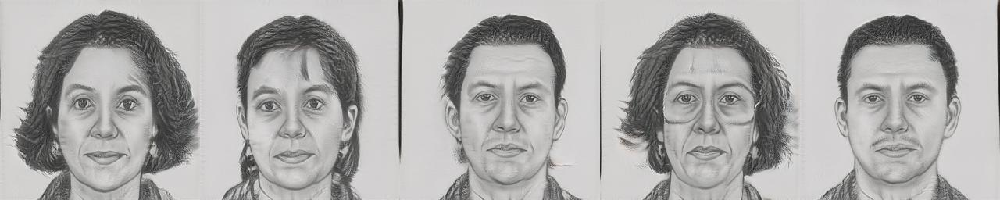
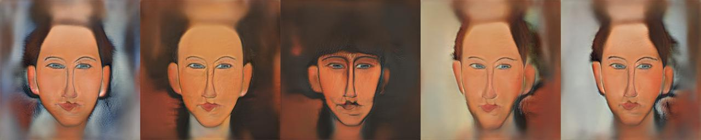
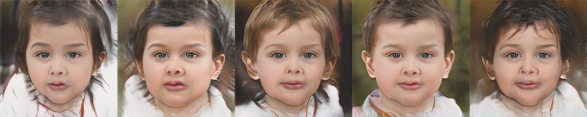
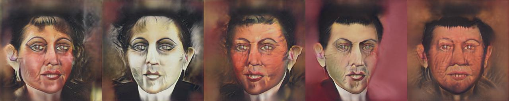
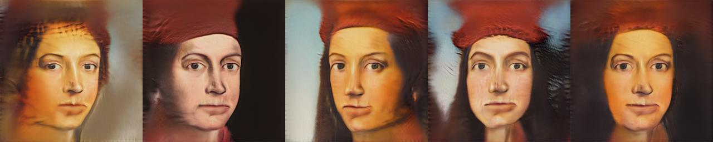

# Few-shot Image Generation via Cross-domain Correspondence

<div align="center"></div>
  
<b>Paper:</b> <a href="https://arxiv.org/abs/2104.06820">https://arxiv.org/abs/2104.06820</a>  
<b>Repository:</b> <a href="https://github.com/utkarshojha/few-shot-gan-adaptation">https://github.com/utkarshojha/few-shot-gan-adaptation</a>  

##### Table of Contents  
* [1. Basic Usage](#usage)
* [2. Checkpoints](#checkpoints)
* [3. Documentation](#documentation)
* [4. Training](#training)
* [5. Images](#images)
* [6. License](#license)


<a name="usage"></a>
## 1. Basic Usage

```python
import jax
import numpy as np
import dill as pickle
from PIL import Image

import flaxmodels as fm

ckpt = pickle.load(open('sketches.pickle', 'rb'))
params = ckpt['params_ema_G']

generator = fm.few_shot_gan_adaption.Generator()

# Seed
key = jax.random.PRNGKey(0)

# Input noise
z = jax.random.normal(key, shape=(4, 512))

# Generate images
images, _ = generator.apply(params, z, truncation_psi=0.5, train=False, noise_mode='const')

# Normalize images to be in range [0, 1]
images = (images - np.min(images)) / (np.max(images) - np.min(images))

# Save images
for i in range(images.shape[0]):
    Image.fromarray(np.uint8(images[i] * 255)).save(f'image_{i}.jpg')

```

<a name="checkpoints"></a>
## 2. Checkpoints
* [Sketches](https://www.dropbox.com/s/azr6b316juhme6c/sketches.pickle?dl=1) (357,2 MB)
* [Amedeo Modigliani](https://www.dropbox.com/s/xrh4a7wt2kggn4v/amedeo_modigliani.pickle?dl=1) (357,2 MB)
* [Babies](https://www.dropbox.com/s/ntictyzrisqg5zh/babies.pickle?dl=1) (357,2 MB)
* [Otto Dix](https://www.dropbox.com/s/u1g18nv73uac21m/otto_dix.pickle?dl=1) (357,2 MB)
* [Rafael](https://www.dropbox.com/s/b8w928s4wffuo2c/raphael.pickle?dl=1) (357,2 MB)


<a name="documentation"></a>
## 3. Documentation
The documentation can be found [here](../../docs/Documentation.md#few_shot_gan_adaption).

<a name="training"></a>
## 4. Training
If you want to train this model in Jax/Flax, go [here](https://github.com/matthias-wright/flaxmodels/tree/main/training/few_shot_gan_adaption).

<a name="images"></a>
## 5. Images

### Sketches
<div></div>

### Amedeo Modigliani
<div></div>

### Babies
<div></div>

### Otto Dix
<div></div>

### Rafael
<div></div>


<a name="license"></a>
## 6. License
<a href="https://mit-license.org/">MIT License</a>


