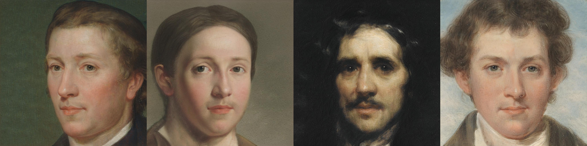
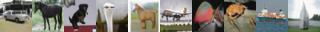
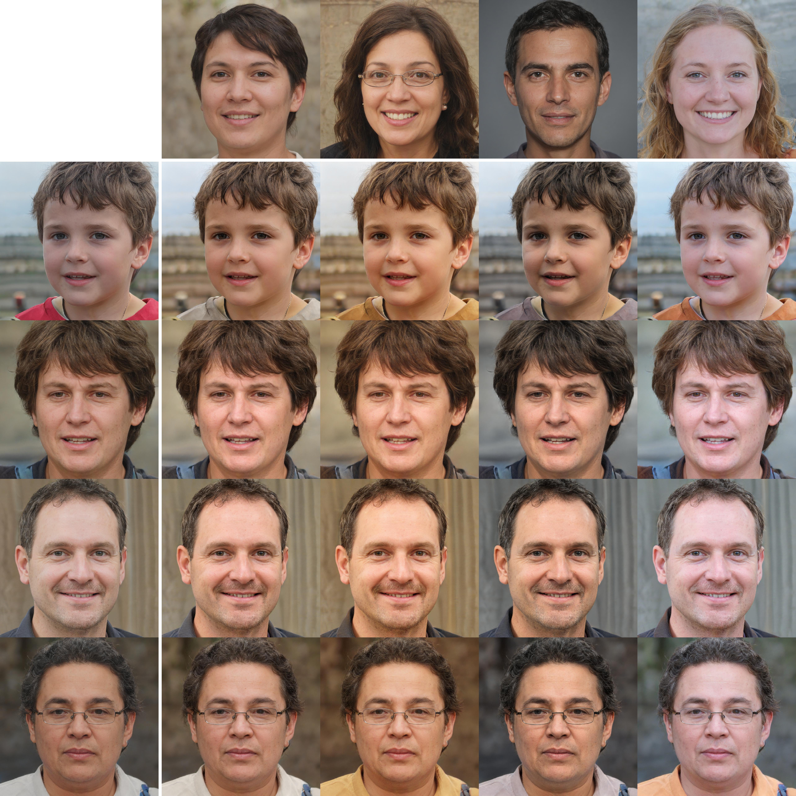

# Analyzing and Improving the Image Quality of StyleGAN

<div align="center"></div>
  
<b>Paper:</b> <a href="https://arxiv.org/abs/1912.04958">https://arxiv.org/abs/1912.04958</a>  
<b>Repository:</b> <a href="https://github.com/NVlabs/stylegan2">https://github.com/NVlabs/stylegan2</a> and <a href="https://github.com/NVlabs/stylegan2-ada">https://github.com/NVlabs/stylegan2-ada</a>

##### Table of Contents  
* [1. Example usages](#usages)
  * [1.1 Generate images without truncation](#gen_img_wo_trunc)
  * [1.2 Generate images with truncation](#gen_img_w_trunc)
  * [1.3 Generate images with labels](#gen_img_w_labels)
  * [1.4 Generate images with style mixing](#gen_img_w_sm)
  * [1.5 Get Discriminator outputs](#dis_output)
* [2. Documentation](#documentation)
  * [2.1 Generator](#doc_generator)
  * [2.2 SynthesisNetwork](#doc_syn)
  * [2.3 MappingNetwork](#doc_map)
  * [2.4 Discriminator](#doc_discriminator)
* [3. Models](#models)
  * [3.1 Metfaces](#metfaces)
  * [3.2 FFHQ](#ffhq)
  * [3.3 AFHQ Wild](#afhqwild)
  * [3.4 AFHQ Dog](#afhqdog)
  * [3.5 AFHQ Cat](#afhqcat)
  * [3.6 LSUN Cat](#cat)
  * [3.7 LSUN Horse](#horse)
  * [3.8 LSUN Car](#car)
  * [3.9 BreCaHAD](#brecahad)
  * [3.10 CIFAR-10](#cifar10)
  * [3.11 LSUN Church](#church)
* [4. License](#license)


<a name="usages"></a>
## 1. Example usages

<a name="gen_img_wo_trunc"></a>
### 1.1 Generate images without truncation

```python
import numpy as np
from PIL import Image
import jax
import jax.numpy as jnp
import flaxmodels as fm

# Seed
key = jax.random.PRNGKey(0)

# Input noise
z = jax.random.normal(key, shape=(4, 512))

generator = fm.stylegan2.Generator(pretrained='metfaces')
params = generator.init(key, z)
images = generator.apply(params, z)

# Normalize images to be in range [0, 1]
images = (images - jnp.min(images)) / (jnp.max(images) - jnp.min(images))

# Save images
for i in range(images.shape[0]):
    Image.fromarray(np.uint8(images[i] * 255)).save(f'image_{i}.jpg')

```

<div align="center"></div>

<a name="gen_img_w_trunc"></a>
### 1.2 Generate images with truncation

```python
import numpy as np
from PIL import Image
import jax
import jax.numpy as jnp
import flaxmodels as fm

# Seed
key = jax.random.PRNGKey(0)

# Input noise
z = jax.random.normal(key, shape=(4, 512))

generator = fm.stylegan2.Generator(pretrained='metfaces')
params = generator.init(key, z, truncation_psi=0.5)
images = generator.apply(params, z, truncation_psi=0.5)

# Normalize images to be in range [0, 1]
images = (images - jnp.min(images)) / (jnp.max(images) - jnp.min(images))

# Save images
for i in range(images.shape[0]):
    Image.fromarray(np.uint8(images[i] * 255)).save(f'image_{i}.jpg')

```

<div align="center"></div>

<a name="gen_img_w_labels"></a>
### 1.3 Generate images with labels

```python
import numpy as np
from PIL import Image
import jax
import jax.numpy as jnp
import flaxmodels as fm

# Seed
key = jax.random.PRNGKey(0)

label = np.zeros((2, 10))
label[0, 0] = 1 # airplane
label[1, 7] = 1 # horse

# Input labels
label = jnp.array(label)

# Input noise
z = jax.random.normal(key, shape=(2, 512))

generator = fm.stylegan2.Generator(pretrained='cifar10')
params = generator.init(key, z, label)
images = generator.apply(params, z, label)

# Normalize images to be in range [0, 1]
images = (images - jnp.min(images)) / (jnp.max(images) - jnp.min(images))

# Save images
for i in range(images.shape[0]):
    Image.fromarray(np.uint8(images[i] * 255)).save(f'image_{i}.jpg')
```

<div align="center"></div>

<a name="gen_img_w_sm"></a>
### 1.4 Generate images with style mixing

```python
import numpy as np
from PIL import Image
import jax
import jax.numpy as jnp
import flaxmodels as fm

key = jax.random.PRNGKey(0)


# Initialize Mapping Network
mapping_net = fm.stylegan2.MappingNetwork(pretrained='ffhq')
mapping_params = mapping_net.init(key, jnp.zeros((1, 512)))

# Initialize Synthesis Network
synthesis_net = fm.stylegan2.SynthesisNetwork(pretrained='ffhq')
synthesis_params = synthesis_net.init(key, jnp.zeros((1, 18, 512)))

# Seeds
row_seeds = [21, 7, 96, 0]
col_seeds = [27, 42, 99, 60]
all_seeds = row_seeds + col_seeds

# Generate noise inputs, [minibatch, component]
all_z = jnp.concatenate([jax.random.normal(jax.random.PRNGKey(seed), shape=(1, 512)) for seed in all_seeds])

# Generate latent vectors, [minibatch, num_ws, component]
all_w = mapping_net.apply(mapping_params, all_z, truncation_psi=0.5)

# Generate images, [minibatch, H, W, 3]
all_images = synthesis_net.apply(synthesis_params, all_w)

# Normalize image to be in range [0, 1]
all_images = (all_images - jnp.min(all_images)) / (jnp.max(all_images) - jnp.min(all_images))

col_images = np.concatenate([all_images[i] for i in range(len(row_seeds))], axis=0)
row_images = np.concatenate([all_images[len(row_seeds) + i] for i in range(len(col_seeds))], axis=1)

images_grid = []

# Generate style mixing images
for row in range(len(row_seeds)):
    image_row = []
    for col in range(len(col_seeds)):
        # Combine first 9 dimensions from row seed latent w with last 9 dimensions from col seed latent w
        w = jnp.concatenate([all_w[row, :9], all_w[len(row_seeds) + col, 9:]], axis=0)
        # Add batch dimension
        w = jnp.expand_dims(w, axis=0)
        image = synthesis_net.apply(synthesis_params, w)
        # Remove batch dimension
        image = jnp.squeeze(image, axis=0)

        # Normalize image to be in range [0, 1]
        image = (image - jnp.min(image)) / (jnp.max(image) - jnp.min(image))
        image_row.append(image)
    image_row = np.concatenate(image_row, axis=1)
    images_grid.append(image_row)

images_grid = np.concatenate(images_grid, axis=0)

# Add row and column images to the grid
border = 20
grid = np.ones((row_images.shape[0] + images_grid.shape[0] + border, 
                col_images.shape[1] + images_grid.shape[1] + border,
                3))
grid[grid.shape[0] - images_grid.shape[0]:, grid.shape[1] - images_grid.shape[1]:] = images_grid
grid[:row_images.shape[0], grid.shape[1] - row_images.shape[1]:] = row_images
grid[grid.shape[0] - col_images.shape[0]:, :col_images.shape[1]] = col_images
Image.fromarray(np.uint8(grid * 255)).save('style_mixing_grid.jpg')
```

<div align="center"></div>


<a name="dis_output"></a>
### 1.5 Get Discriminator outputs

```python
import jax
import flaxmodels as fm

key = jax.random.PRNGKey(0)

img = jax.random.normal(key, shape=(1, 1024, 1024, 3))

discriminator = fm.stylegan2.Discriminator(pretrained='metfaces')
params = discriminator.init(key, img)
out = discriminator.apply(params, img)
```


<a name="documentation"></a>
## 2. Documentation

<a name="doc_generator"></a>
### 2.1 Generator
flaxmodels.stylegan2.Generator(*resolution=1024, num_channels=3, z_dim=512, c_dim=0, w_dim=512, mapping_layer_features=512, mapping_embed_features=None, num_ws=18, num_mapping_layers=8, fmap_base=16384, fmap_decay=1, fmap_min=1, fmap_max=512, fmap_const=None, pretrained=None, ckpt_dir=None, use_noise=True, randomize_noise=True, activation='leaky_relu', w_avg_beta=0.995, mapping_lr_multiplier=0.01, resample_kernel=[1, 3, 3, 1], fused_modconv=False, dtype='float32', rng=jax.random.PRNGKey(0)*)


#### Parameters
* **resolution (int)** - Output resolution.
* **num_channels (int)** - Number of output color channels.
* **z_dim (int)** - Input latent (W) dimensionality.
* **c_dim (int)** - Conditioning label (C) dimensionality, 0 = no label.
* **w_dim (int)** - Input latent (Z) dimensionality.
* **mapping_layer_features (int)** - Number of intermediate features in the mapping layers, None = same as w_dim.
* **mapping_embed_features (int)** - Label embedding dimensionality, None = same as w_dim.
* **num_ws (int)** - Number of intermediate latents to output, None = do not broadcast.
* **num_mapping_layers (int)** - Number of mapping layers.
* **fmap_base (int)** - Overall multiplier for the number of feature maps.
* **fmap_decay (int)** - Log2 feature map reduction when doubling the resolution.
* **fmap_min (int)** - Minimum number of feature maps in any layer.
* **fmap_max (int)** - Maximum number of feature maps in any layer.
* **fmap_const (int)** - Number of feature maps in the constant input layer. None = default.
* **pretrained (str)** - Which pretrained model to use, None for random initialization. Options:
  * 'afhqcat': AFHQ Cat dataset, resolution 512x512.
  * 'afhqdog': AFHQ Dog dataset, resolution 512x512.
  * 'afhqwild': AFHQ Wild dataset, resolution 512x512.
  * 'brecahad': BreCaHAD dataset, resolution 512x512.
  * 'car': LSUN Car dataset, resolution 512x512.
  * 'cat': LSUN Cat dataset, resolution 256x256.
  * 'church': LSUN Church dataset, resolution 256x256.
  * 'cifar10': CIFAR-10 dataset, resolution 32x32.
  * 'ffhq': FFHQ dataset, resolution 1024x1024.
  * 'horse': LSUN Horse dataset, resolution 256x256.
  * 'metfaces': MetFaces dataset, resolution 1024x1024.
* **ckpt_dir (str)** - The directory to which the pretrained weights are downloaded. Only relevant if a pretrained model is used. If this argument is None, the weights will be saved to a temp directory.
* **use_noise (bool)** - Inject noise in synthesis layers.
* **randomize_noise (bool)** - Use random noise.
* **activation (str)** - Activation function. Options:
  * 'relu'
  * 'leaky_relu'
  * 'linear'
* **w_avg_beta (float)** - Decay for tracking the moving average of W during training, None = do not track.
* **mapping_lr_multiplier (float)** - Learning rate multiplier for mapping network.
* **resample_kernel (list or tuple)** - Low-pass filter to apply when resampling activations, None = box filter.
* **fused_modconv (bool)** - Implement modulated_conv2d_layer() using grouped convolution?
* **dtype (str)** - Data dtype.
* **rng (jax.numpy.ndarray)** - Random seed.

#### Methods
apply(*z, c=None, truncation_psi=1, truncation_cutoff=None, skip_w_avg_update=False*)


##### Parameters
* **z (jax.numpy.ndarray)** - Noise inputs, shape [batch, z_dim].
* **c (jax.numpy.ndarray)** - Conditional input, shape [batch, c_dim].
* **truncation_psi (float)** - Parameter that controls the linear interpolation for the truncation trick. 1 = no truncation.
* **truncation_cutoff (int)** - Number of layers for which to apply the truncation trick. None = disable.
* **skip_w_avg_update (bool)** - Don't update moving average for latent variable w.


<a name="doc_syn"></a>
### 2.2 SynthesisNetwork

flaxmodels.stylegan2.SynthesisNetwork(*resolution=1024, num_channels=3, w_dim=512, fmap_base=16384, fmap_decay=1, fmap_min=1, fmap_max=512, fmap_const=None, pretrained=None, param_dict=None, ckpt_dir=None, activation='leaky_relu', use_noise=True, randomize_noise=True, resample_kernel=[1, 3, 3, 1], fused_modconv=False, dtype='float32', rng=jax.random.PRNGKey(0)*)

#### Parameters
* **resolution (int)** - Output resolution.
* **num_channels (int)** - Number of output color channels.
* **w_dim (int)** - Input latent (W) dimensionality.
* **fmap_base (int)** - Overall multiplier for the number of feature maps.
* **fmap_decay (int)** - Log2 feature map reduction when doubling the resolution.
* **fmap_min (int)** - Minimum number of feature maps in any layer.
* **fmap_max (int)** - Maximum number of feature maps in any layer.
* **fmap_const (int)** - Number of feature maps in the constant input layer. None = default.
* **pretrained (str)** - Which pretrained model to use, None for random initialization. Options:
  * 'afhqcat': AFHQ Cat dataset, resolution 512x512.
  * 'afhqdog': AFHQ Dog dataset, resolution 512x512.
  * 'afhqwild': AFHQ Wild dataset, resolution 512x512.
  * 'brecahad': BreCaHAD dataset, resolution 512x512.
  * 'car': LSUN Car dataset, resolution 512x512.
  * 'cat': LSUN Cat dataset, resolution 256x256.
  * 'church': LSUN Church dataset, resolution 256x256.
  * 'cifar10': CIFAR-10 dataset, resolution 32x32.
  * 'ffhq': FFHQ dataset, resolution 1024x1024.
  * 'horse': LSUN Horse dataset, resolution 256x256.
  * 'metfaces': MetFaces dataset, resolution 1024x1024.
* **param_dict (h5py.Group)** - Parameter dict with pretrained parameters. If not None, 'pretrained' will be ignored.
* **ckpt_dir (str)** - The directory to which the pretrained weights are downloaded. Only relevant if a pretrained model is used. If this argument is None, the weights will be saved to a temp directory.
* **activation (str)** - Activation function. Options:
  * 'relu'
  * 'leaky_relu'
  * 'linear'
* **use_noise (bool)** - Inject noise in synthesis layers.
* **randomize_noise (bool)** - Use random noise.
* **resample_kernel (list or tuple)** - Low-pass filter to apply when resampling activations, None = box filter.
* **fused_modconv (bool)** - Implement modulated_conv2d_layer() using grouped convolution?
* **dtype (str)** - Data dtype.
* **rng (jax.numpy.ndarray)** - Random seed.

#### Methods
apply(*dlatents_in*)

##### Parameters
* **dlatents_in (jax.numpy.ndarray)** - Latent input W, shape [batch, w_dim].


<a name="doc_map"></a>
### 2.3 MappingNetwork
flaxmodels.stylegan2.MappingNetwork(*z_dim=512, c_dim=0, w_dim=512, embed_features=None, layer_features=512, num_ws=18, num_layers=8, pretrained=None, param_dict=None, ckpt_dir=None, activation='leaky_relu', lr_multiplier=0.01, w_avg_beta=0.995, dtype='float32', rng=jax.random.PRNGKey(0)*)

#### Parameters
* **z_dim (int)** - Input latent (Z) dimensionality.
* **c_dim (int)** - Input latent (C) dimensionality, 0 = no label.
* **w_dim (int)** - Input latent (W) dimensionality.
* **embed_features (int)** - Label embedding dimensionality, None = same as w_dim.
* **layer_features (int)** - Number of intermediate features in the mapping layers, None = same as w_dim.
* **num_ws (int)** - Number of intermediate latents to output, None = do not broadcast.
* **num_layers (int)** - Number of mapping layers.
* **pretrained (str)** - Which pretrained model to use, None for random initialization. Options:
  * 'afhqcat': AFHQ Cat dataset, resolution 512x512.
  * 'afhqdog': AFHQ Dog dataset, resolution 512x512.
  * 'afhqwild': AFHQ Wild dataset, resolution 512x512.
  * 'brecahad': BreCaHAD dataset, resolution 512x512.
  * 'car': LSUN Car dataset, resolution 512x512.
  * 'cat': LSUN Cat dataset, resolution 256x256.
  * 'church': LSUN Church dataset, resolution 256x256.
  * 'cifar10': CIFAR-10 dataset, resolution 32x32.
  * 'ffhq': FFHQ dataset, resolution 1024x1024.
  * 'horse': LSUN Horse dataset, resolution 256x256.
  * 'metfaces': MetFaces dataset, resolution 1024x1024.
* **param_dict (h5py.Group)** - Parameter dict with pretrained parameters. If not None, 'pretrained' will be ignored.
* **ckpt_dir (str)** - The directory to which the pretrained weights are downloaded. Only relevant if a pretrained model is used. If this argument is None, the weights will be saved to a temp directory.
* **activation (str)** - Activation function. Options:
  * 'relu'
  * 'leaky_relu'
  * 'linear'
* **lr_multiplier (float)** - Learning rate multiplier for the mapping layers.
* **w_avg_beta (float)** - Decay for tracking the moving average of W during training, None = do not track.
* **dtype (str)** - Data dtype.
* **rng (jax.numpy.ndarray)** - Random seed.

#### Methods
apply(*z, c=None, truncation_psi=1, truncation_cutoff=None, skip_w_avg_update=False*)

##### Parameters
* **z (jax.numpy.ndarray)** - Noise inputs, shape [batch, z_dim].
* **c (jax.numpy.ndarray)** - Conditional input, shape [batch, c_dim].
* **truncation_psi (float)** - Parameter that controls the linear interpolation for the truncation trick. 1 = no truncation.
* **truncation_cutoff (int)** - Number of layers for which to apply the truncation trick. None = disable.
* **skip_w_avg_update (bool)** - Don't update moving average for latent variable w.


<a name="doc_discriminator"></a>
### 2.4 Discriminator
flaxmodels.stylegan2.Discriminator(*resolution=3, num_channels=3, c_dim=0, fmap_base=16384, fmap_decay=1, fmap_min=1, fmap_max=512, mapping_layers=0, mapping_fmaps=None, mapping_lr_multiplier=0.1, architecture='resnet', activation='leaky_relu', mbstd_group_size=None, mbstd_num_features=1, resample_kernel=[1, 3, 3, 1], pretrained=None, ckpt_dir=None, dtype='float32', rng=jax.random.PRNGKey(0)*)

#### Parameters
* **resolution (int)** - Output resolution.
* **num_channels (int)** - Number of output color channels.
* **c_dim (int)** - Dimensionality of the labels (c), 0 if no labels. Overritten based on dataset.
* **fmap_base (int)** - Overall multiplier for the number of feature maps.
* **fmap_decay (int)** - Log2 feature map reduction when doubling the resolution.
* **fmap_min (int)** - Minimum number of feature maps in any layer.
* **fmap_max (int)** - Maximum number of feature maps in any layer.
* **mapping_layers (int)** - Number of additional mapping layers for the conditioning labels.
* **mapping_fmaps (int)** - Number of activations in the mapping layers, None = default.
* **mapping_lr_multiplier (int)** - Learning rate multiplier for the mapping layers.
* **architecture (str)** - Architecture. Options:
  * 'orig'
  * 'resnet'
* **activation (str)** - Activation function. Options:
  * 'relu'
  * 'leaky_relu'
  * 'linear'
* **mbstd_group_size (int)** - Group size for the minibatch standard deviation layer, None = entire minibatch.
* **mbstd_num_features (int)** - Number of features for the minibatch standard deviation layer, 0 = disable.
* **resample_kernel (list or tuple)** - Low-pass filter to apply when resampling activations, None = box filter.
* **pretrained (str)** - Which pretrained model to use, None for random initialization. Options:
  * 'afhqcat': AFHQ Cat dataset, resolution 512x512.
  * 'afhqdog': AFHQ Dog dataset, resolution 512x512.
  * 'afhqwild': AFHQ Wild dataset, resolution 512x512.
  * 'brecahad': BreCaHAD dataset, resolution 512x512.
  * 'car': LSUN Car dataset, resolution 512x512.
  * 'cat': LSUN Cat dataset, resolution 256x256.
  * 'church': LSUN Church dataset, resolution 256x256.
  * 'cifar10': CIFAR-10 dataset, resolution 32x32.
  * 'ffhq': FFHQ dataset, resolution 1024x1024.
  * 'horse': LSUN Horse dataset, resolution 256x256.
  * 'metfaces': MetFaces dataset, resolution 1024x1024.
* **ckpt_dir (str)** - The directory to which the pretrained weights are downloaded. Only relevant if a pretrained model is used. If this argument is None, the weights will be saved to a temp directory.
* **dtype (str)** - Data dtype.
* **rng (jax.numpy.ndarray)** - Random seed.

#### Methods
apply(*z, c=None*)

##### Parameters
* **z (jax.numpy.ndarray)** - Noise inputs, shape [batch, z_dim].
* **c (jax.numpy.ndarray)** - Conditional input, shape [batch, c_dim].

<a name="models"></a>
## 3. Models

<a name="metfaces"></a>
### 3.1 Metfaces
<div></div>

<a name="ffhq"></a>
### 3.2 FFHQ
<div></div>

<a name="afhqwild"></a>
### 3.3 AFHQ Wild
<div></div>

<a name="afhqdog"></a>
### 3.4 AFHQ Dog
<div></div>

<a name="afhqcat"></a>
### 3.5 AFHQ Cat
<div></div>

<a name="cat"></a>
### 3.6 LSUN Cat
<div></div>

<a name="horse"></a>
### 3.7 LSUN Horse
<div></div>

<a name="car"></a>
### 3.8 LSUN Car
<div></div>

<a name="brecahad"></a>
### 3.9 BreCaHAD
<div></div>

<a name="cifar10"></a>
### 3.10 CIFAR-10
<div></div>

<a name="church"></a>
### 3.11 LSUN Church
<div></div>


<a name="license"></a>
## 4. License
<a href="https://nvlabs.github.io/stylegan2/license.html">Nvidia Source Code License-NC</a>


