# Analyzing and Improving the Image Quality of StyleGAN

<div align="center">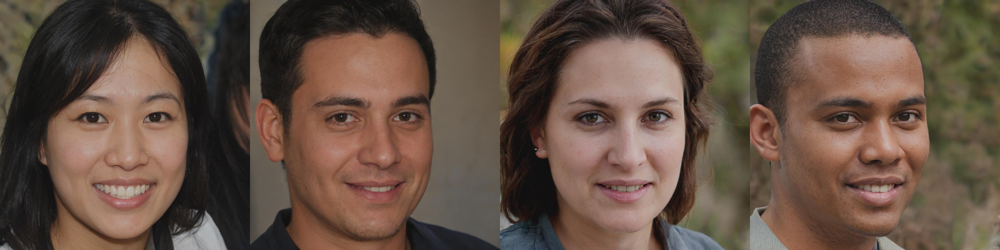</div>
  
<b>Paper:</b> <a href="https://arxiv.org/abs/1912.04958">https://arxiv.org/abs/1912.04958</a>  
<b>Repository:</b> <a href="https://github.com/NVlabs/stylegan2">https://github.com/NVlabs/stylegan2</a> and <a href="https://github.com/NVlabs/stylegan2-ada">https://github.com/NVlabs/stylegan2-ada</a>

##### Table of Contents  
* [1. Basic Usage](#usage)
* [2. Documentation](#documentation)
* [3. Training](#training)
* [4. Pretrained Models](#models)
* [5. License](#license)


<a name="usage"></a>
## 1. Basic Usage
For more usage examples check out this [Colab](stylegan2_demo.ipynb).

```python
import numpy as np
from PIL import Image
import jax
import jax.numpy as jnp
import flaxmodels as fm

# Seed
key = jax.random.PRNGKey(0)

# Input noise
z = jax.random.normal(key, shape=(4, 512))

generator = fm.stylegan2.Generator(pretrained='metfaces')
params = generator.init(key, z)
images = generator.apply(params, z, train=False)

# Normalize images to be in range [0, 1]
images = (images - jnp.min(images)) / (jnp.max(images) - jnp.min(images))

# Save images
for i in range(images.shape[0]):
    Image.fromarray(np.uint8(images[i] * 255)).save(f'image_{i}.jpg')

```

<div align="center">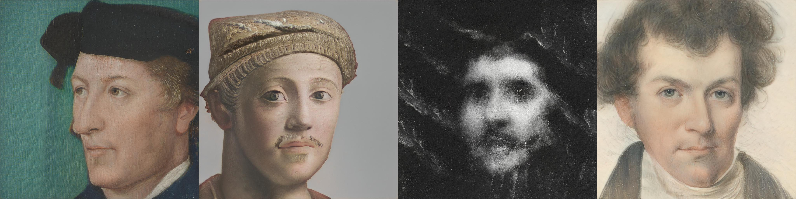</div>

<a name="documentation"></a>
## 2. Documentation
The documentation can be found [here](../../docs/Documentation.md#stylegan2).

<a name="training"></a>
## 3. Training
If you want to train StyleGAN2 in Jax/Flax, go [here](https://github.com/matthias-wright/flaxmodels/tree/main/training/stylegan2).

<a name="models"></a>
## 4. Pretrained Models

### Metfaces
<div></div>

### FFHQ
<div></div>

### AFHQ Wild
<div>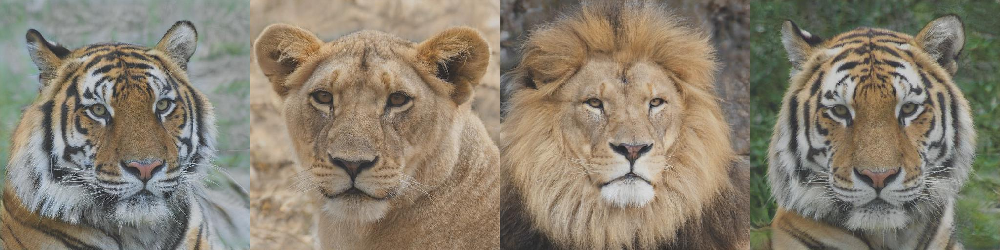</div>

### AFHQ Dog
<div>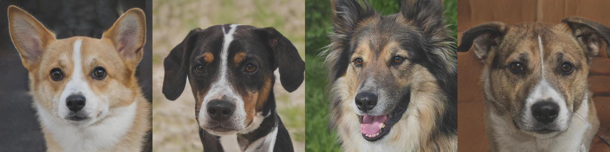</div>

### AFHQ Cat
<div>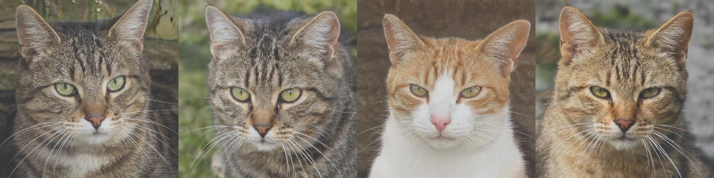</div>

### LSUN Cat
<div>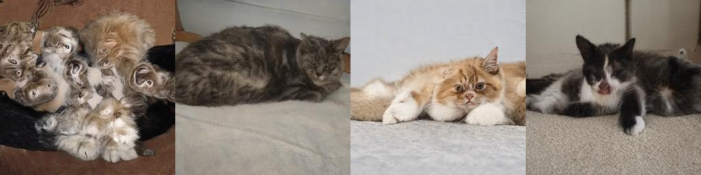</div>

### LSUN Horse
<div>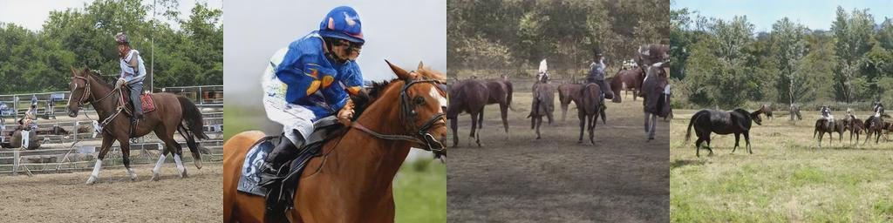</div>

### LSUN Car
<div>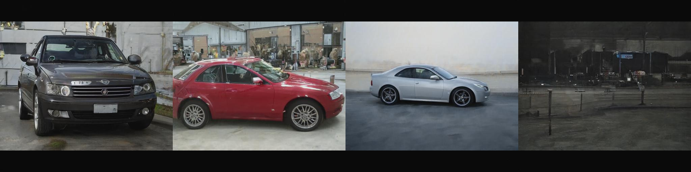</div>

### BreCaHAD
<div>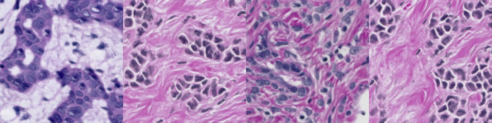</div>

### CIFAR-10
<div>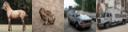</div>

### LSUN Church
<div>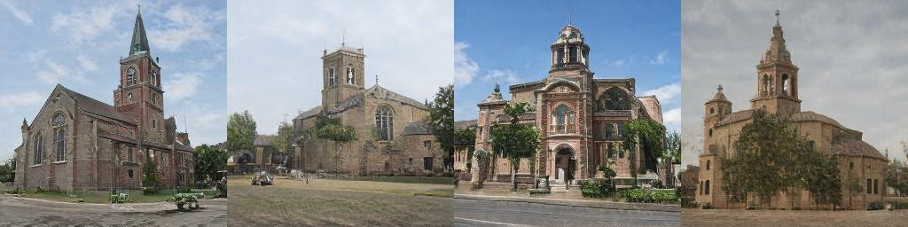</div>


<a name="license"></a>
## 5. License
<a href="https://nvlabs.github.io/stylegan2/license.html">Nvidia Source Code License-NC</a>


