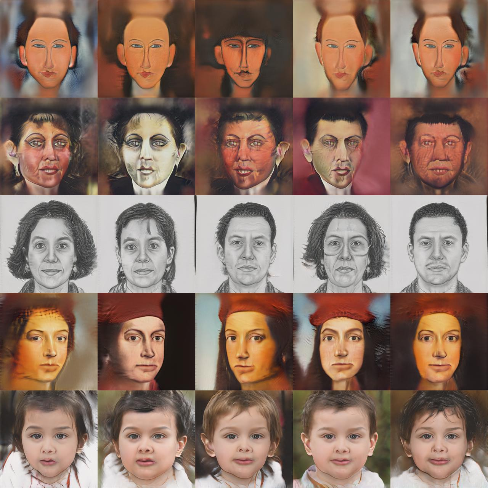

# Few-shot Image Generation via Cross-domain Correspondence Training in Jax/Flax
This is the training code for the [Jax/Flax implementation](https://github.com/matthias-wright/flaxmodels/tree/main/flaxmodels/few_shot_gan_adaption) of [Few-shot Image Generation via Cross-domain Correspondence](https://arxiv.org/abs/2104.06820).

<div align="center"></div>

#### Table of Contents
* [Getting Started](#getting-started)
* [Preparing Datasets for Training](#preparing-datasets-for-training)
* [Training](#training)
* [Checkpoints](#checkpoints)
* [Generating Images](#generating-images)
* [References](#references)
* [License](#license)


## Getting Started
You will need Python 3.7 or later.
 
1. Clone the repository:
   ```sh
   > git clone https://github.com/matthias-wright/flaxmodels.git
   ```
2. Go into the directory:
   ```sh
   > cd flaxmodels/training/few_shot_gan_adaption
   ```
3. Install <a href="https://github.com/google/jax#installation">Jax</a> with CUDA.
4. Install requirements: 
   ```sh
   > pip install -r requirements.txt
   ```

## Preparing Datasets for Training
Before training, the images should be stored in a [TFRecord dataset](https://www.tensorflow.org/tutorials/load_data/tfrecord). The TFRecord format stores your data as a sequence of bytes, which allows for fast data loading.  
Alternatively, you can also use [tfds.folder_dataset.ImageFolder](https://www.tensorflow.org/datasets/api_docs/python/tfds/folder_dataset/ImageFolder) on the image directory directly but you will have to replace the `tf.data.TFRecordDataset` in `data_pipeline.py` with `tfds.folder_dataset.ImageFolder` (see [this](https://github.com/matthias-wright/flaxmodels/issues/8#issue-1020780783) thread for more info).

1. Download dataset from [here](https://github.com/utkarshojha/few-shot-gan-adaptation#choose-the-target-domain).
2. Put all images into a directory:
   ```
   /path/to/image_dir/
       0.jpg
       1.jpg
       2.jpg
       4.jpg
       ... 
   ```
3. Create TFRecord dataset:
   ```sh
   > python dataset_utils/images_to_tfrecords.py --image_dir /path/to/image_dir/ --data_dir /path/to/tfrecord
   ```
   `--image_dir` is the path to the image directory.  
   `--data_dir` is the path where the TFRecord dataset is stored.
   

## Training
Download checkpoint of source model:
```sh
> wget https://www.dropbox.com/s/hyh1k8ixtzy24ye/ffhq_256x256.pickle\?dl\=1 -O ffhq_256x256.pickle
```

Start training:
```python
> CUDA_VISIBLE_DEVICES=a,b,c,d python main.py --data_dir /path/to/tfrecord --source_ckpt_path ffhq_256x256.pickle
```
Here `a`, `b`, `c`, `d` are the GPU indices. Multi GPU training (data parallelism) works by default and will automatically use all the devices that you make visible.


### Logging
I use [Weights & Biases](https://wandb.ai/site) for logging but you can simply replace it with the logging method of your choice. The logging happens all in the training loop implemented in `training.py`. To use logging with Weights & Biases, use `--wand`.

### Checkpointing
By default, every `1000` training steps the FID score is evaluated for `10.000` images. The checkpoint with the highest FID score is saved. You can change evaluation frequency using the `--eval_fid_every` argument and the number of images to evaluate the FID score on using `--num_fid_images`.  
You can disable the FID score evaluation using `--disable_fid`. In that case, a checkpoint will be saved every `2000` steps (can be changed using `--save_every`).


## Checkpoints
* [Sketches](https://www.dropbox.com/s/azr6b316juhme6c/sketches.pickle?dl=1) (357,2 MB)
* [Amedeo Modigliani](https://www.dropbox.com/s/xrh4a7wt2kggn4v/amedeo_modigliani.pickle?dl=1) (357,2 MB)
* [Babies](https://www.dropbox.com/s/ntictyzrisqg5zh/babies.pickle?dl=1) (357,2 MB)
* [Otto Dix](https://www.dropbox.com/s/u1g18nv73uac21m/otto_dix.pickle?dl=1) (357,2 MB)
* [Rafael](https://www.dropbox.com/s/b8w928s4wffuo2c/raphael.pickle?dl=1) (357,2 MB)

## Generating Images
```python
import jax
import numpy as np
import dill as pickle
from PIL import Image

import flaxmodels as fm

ckpt = pickle.load(open('sketches.pickle', 'rb'))
params = ckpt['params_ema_G']

generator = fm.few_shot_gan_adaption.Generator()

# Seed
key = jax.random.PRNGKey(0)

# Input noise
z = jax.random.normal(key, shape=(4, 512))

# Generate images
images, _ = generator.apply(params, z, truncation_psi=0.5, train=False, noise_mode='const')

# Normalize images to be in range [0, 1]
images = (images - np.min(images)) / (np.max(images) - np.min(images))

# Save images
for i in range(images.shape[0]):
    Image.fromarray(np.uint8(images[i] * 255)).save(f'image_{i}.jpg')

```

## References
* [utkarshojha/few-shot-gan-adaptation](https://github.com/utkarshojha/few-shot-gan-adaptation)


## License
[MIT License](https://opensource.org/licenses/MIT)

