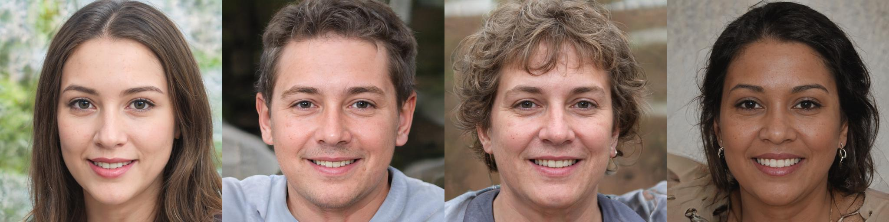
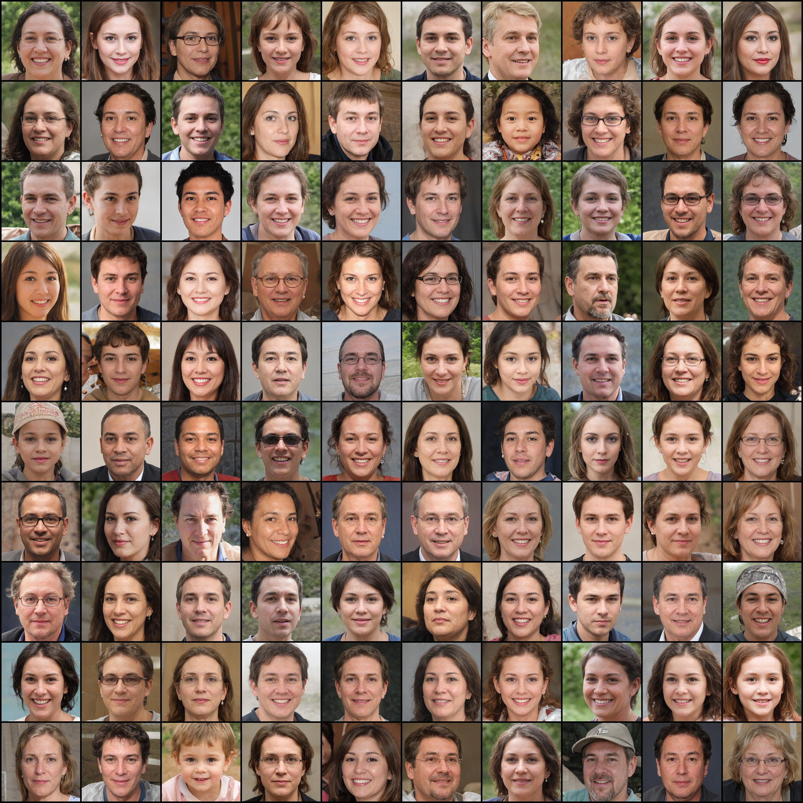
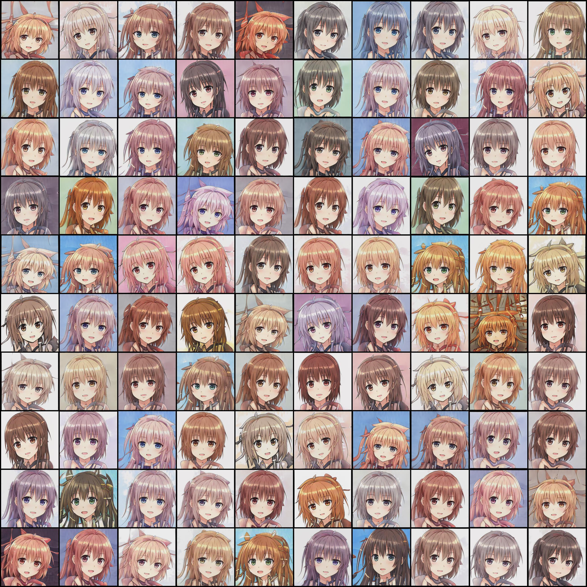
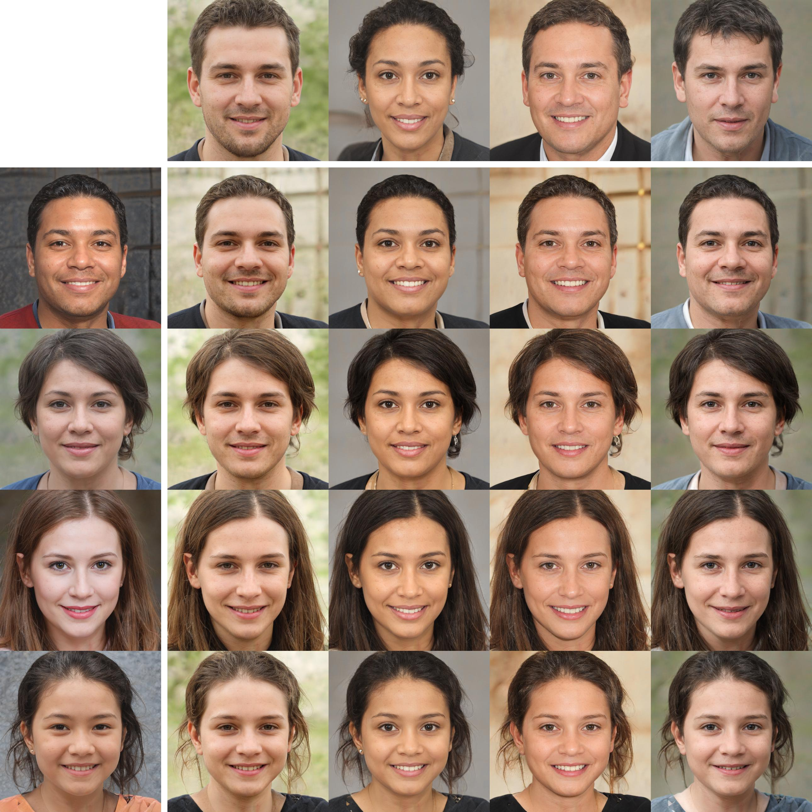
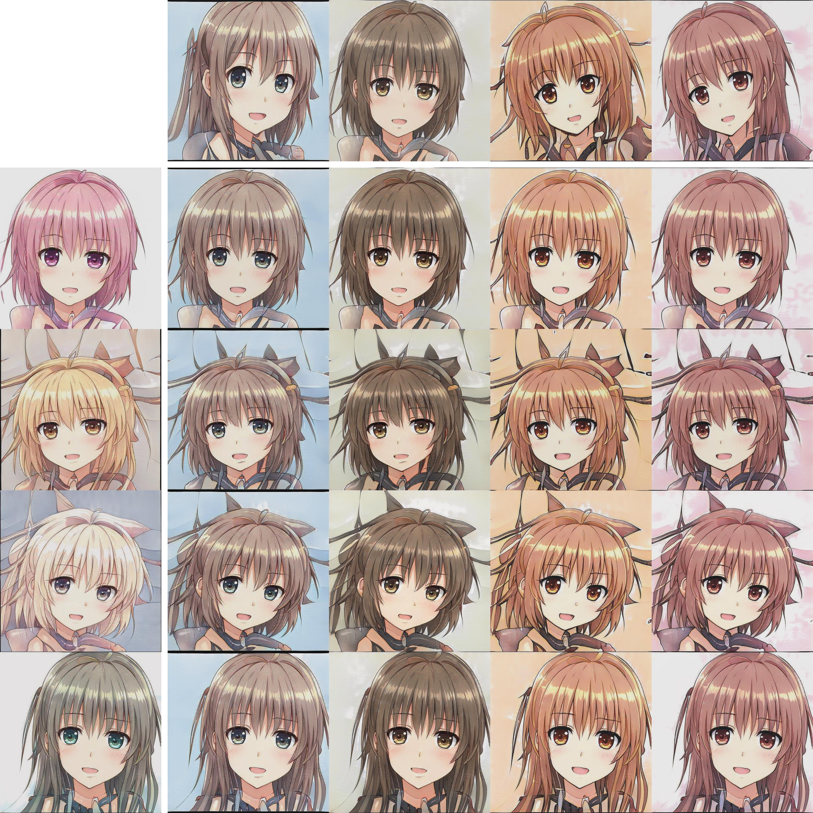

# StyleGAN2 Training in Jax/Flax
This is the training code for the [Jax/Flax implementation](https://github.com/matthias-wright/flaxmodels/tree/main/flaxmodels/stylegan2) of [StyleGAN2](https://arxiv.org/abs/1912.04958).

<div align="center"></div>
<div align="center"></div>

#### Table of Contents
* [Getting Started](#getting-started)
* [Preparing Datasets for Training](#preparing-datasets-for-training)
* [Training](#training)
* [Checkpoints](#checkpoints)
* [Generate Images](#generate-images)
* [Samples](#samples)
* [Original Checkpoints](#original-checkpoints)
* [References](#references)
* [License](#license)


## Getting Started
You will need Python 3.7 or later.
 
1. Clone the repository:
   ```sh
   > git clone https://github.com/matthias-wright/flaxmodels.git
   ```
2. Go into the directory:
   ```sh
   > cd flaxmodels/training/stylegan2
   ```
3. Install <a href="https://github.com/google/jax#installation">Jax</a> with CUDA.
4. Install requirements: 
   ```sh
   > pip install -r requirements.txt
   ```

## Preparing Datasets for Training
Before training, the images should be stored in a [TFRecord dataset](https://www.tensorflow.org/tutorials/load_data/tfrecord). The TFRecord format stores your data as a sequence of bytes, which allows for fast data loading.  
Alternatively, you can also use [tfds.folder_dataset.ImageFolder](https://www.tensorflow.org/datasets/api_docs/python/tfds/folder_dataset/ImageFolder) on the image directory directly but you will have to replace the `tf.data.TFRecordDataset` in `data_pipeline.py` with `tfds.folder_dataset.ImageFolder` (see [this](https://github.com/matthias-wright/flaxmodels/issues/8#issue-1020780783) thread for more info).

### FFHQ
1. Download the [cropped and aligned images](https://drive.google.com/drive/folders/1tZUcXDBeOibC6jcMCtgRRz67pzrAHeHL). Alternatively, you can also download the [thumbnails at 128x128 resolution](https://drive.google.com/drive/folders/1tg-Ur7d4vk1T8Bn0pPpUSQPxlPGBlGfv).
2. Unzip and `cd` into the extracted directory.
3. Move the images from the subdirectories into the main directory (because there aren't any labels): 
   ```sh
   > find . -mindepth 2 -type f -print -exec mv {} . \;
     ```
4. Remove empty subdirectories:
   ```sh
   > rm -r */
   ```
5. Create TFRecord dataset:
   ```sh
   > python dataset_utils/images_to_tfrecords.py --image_dir /path/to/image_dir/ --data_dir /path/to/tfrecord
   ```
   `--image_dir` is the path to the image directory.  
   `--data_dir` is the path where the TFRecord dataset is stored.


### Danbooru2019 Portraits
1. Download the images from [here](https://www.gwern.net/Crops#portraits-dataset):
   ```sh
   > rsync --verbose --recursive rsync://78.46.86.149:873/biggan/portraits/ ./portraits/
   ```
2. Many of the images in this dataset have black borders. These can be mostly removed with this command:
   ```sh
   > python dataset_utils/crop_image_borders.py --image_dir ./portraits/
   ```
3. Create TFRecord dataset:
   ```sh
   > python dataset_utils/images_to_tfrecords.py --image_dir ./portraits/ --data_dir /path/to/tfrecord
   ```
   `--image_dir` is the path to the image directory.  
   `--data_dir` is the path where the TFRecord dataset is stored.
   
### Your Own Dataset
I am assuming that your dataset is an image folder containing JPEG or PNG files (with or without label subfolders). If you have labels, your image folder should have the following structure:

```
/path/to/image_dir/
    label0/
	    0.jpg
	    1.jpg
	    ...
    label1/
	    a.jpg
	    b.jpg
	    c.jpg
	    ...
    ...
```
If you don't have labels, your image folder should look like this:

```
/path/to/image_dir/
    0.jpg
    1.jpg
    2.jpg
    4.jpg                                        
    ... 
```                                                                                 
Create a TFRecord dataset dataset from the image folder:

```python
> python dataset_utils/images_to_tfrecords.py --image_dir /path/to/image_dir/ --data_dir /path/to/tfrecord
```
If you have labels, additionally use the `--has_labels` flag. The TFRecord dataset will be stored at `/path/to/tfrecord`.  

[TensorFlow Datasets](https://github.com/tensorflow/datasets/tree/master/tensorflow_datasets) also has many datasets to choose from. You will have to replace the `tf.data.TFRecordDataset` in `data_pipeline.py` with that dataset.

## Training
**To start training with default arguments:**
```python
> CUDA_VISIBLE_DEVICES=a,b,c,d python main.py --data_dir /path/to/tfrecord
```
Here `a`, `b`, `c`, `d` are the GPU indices. Multi GPU training (data parallelism) works by default and will automatically use all the devices that you make visible.

**To reproduce the results on FFHQ and Danbooru2019 Portraits with resolution 512x512:**
```python
> CUDA_VISIBLE_DEVICES=a,b,c,d python main.py --data_dir /path/to/tfrecord --resolution 512 --batch_size 8 --learning_rate 0.0025 --r1_gamma 0.5 --mbstd_group_size 8 --fmap_base 32768 --wandb 
```


**Some guidelines for choosing the hyperparameters** (taken from [here](https://github.com/NVlabs/stylegan2-ada-pytorch/blob/main/train.py#L154)):

|                  | 256x256 | 512x512 | 1024x1024   |
|------------------|---------|---------|-------------|
| batch_size       | 8       | 8       | 4           |
| fmap_base        | 16384   | 32768   | 32768       |
| learning_rate    | 0.0025  | 0.0025  | 0.002       |
| r1_gamma         | 1.0     | 0.5     | 2.0 or 10.0 |
| ema_kimg         | 20      | 20      | 10          |
| mbstd_group_size | 8       | 8       | 4           |


### Logging
I use [Weights & Biases](https://wandb.ai/site) for logging but you can simply replace it with the logging method of your choice. The logging happens all in the training loop implemented in `training.py`. To use logging with Weights & Biases, use `--wand`. The Weights & Biases logging can be configured in line 60 of `main.py`.

### Checkpointing
By default, every `1000` training steps the FID score is evaluated for `10.000` images. The checkpoint with the highest FID score is saved. You can change evaluation frequency using the `--eval_fid_every` argument and the number of images to evaluate the FID score on using `--num_fid_images`.  
You can disable the FID score evaluation using `--disable_fid`. In that case, a checkpoint will be saved every `2000` steps (can be changed using `--save_every`).

### Mixed Precision
Mixed precision training is implemented and can be activated using `--mixed_precision`. However, at the moment it is not stable so I don't recommend using it until further notice.  
I have implemented all the mixed precision tricks from the original StyleGAN2 implementation (casting to float32 for some operations, using pre-normalization in the modulated conv layer, only using float16 for the higher resolutions, clipping the output of the convolution layers, etc).  
Dynamic loss scaling is also implemented with [dynamic_scale_lib.DynamicScale](https://flax.readthedocs.io/en/latest/_autosummary/dynamic_scale_lib.DynamicScale.html).  
I will look into it. If you figure it out, you are more than welcome to submit a PR.

## Checkpoints
I have trained StyleGAN2 from scratch on [FFHQ](https://github.com/NVlabs/ffhq-dataset) and [Danbooru2019 Portraits](https://www.gwern.net/Crops), both at resolution 512x512.

* [FFHQ at 512x512](https://www.dropbox.com/s/qm7ot3k81wlhh6m/ffhq_512x512.pickle?dl=1) (922,1 MB)
* [FFHQ at 256x256](https://www.dropbox.com/s/db346eqi4ru6h3p/ffhq_256x256.pickle?dl=1) (828,4 MB)
* [Danbooru2019 Portraits at 512x512](https://www.dropbox.com/s/coqp8jkvu37a1kh/danbooru2019_512x512.pickle?dl=1) (922,1 MB)


## Generate Images

**Generate Images:**

1. Download checkpoint:
   ```sh
   > wget https://www.dropbox.com/s/qm7ot3k81wlhh6m/ffhq_512x512.pickle
   ```
2. Generate images, one image will be generated for each seed:
   ```python
    > CUDA_VISIBLE_DEVICES=0 python generate_images.py --ckpt_path ffhq_512x512.pickle --seeds 1 2 3 4
   ```

**Style Mixing:**

1. Download checkpoint:
   ```sh
   > wget https://www.dropbox.com/s/qm7ot3k81wlhh6m/ffhq_512x512.pickle
   ```
2. Generate style mixing grid:
   ```python
    > CUDA_VISIBLE_DEVICES=0 python style_mixing.py --ckpt_path ffhq_512x512.pickle --row_seeds 1 2 3 4 --col_seeds 5 6 7 8
   ```

## Samples

<div align="center"></div>
<div align="center"></div>

### Style Mixing

<div align="center"></div>
<div align="center"></div>


## Original Checkpoints
The implementation is compatible with the pretrained weights from NVIDIA. To generate images in Jax/Flax using the original checkpoints from NVIDIA, go [here](https://github.com/matthias-wright/flaxmodels/tree/main/flaxmodels/stylegan2).


## Acknowledgements
* Thank you to [moabarar](https://github.com/moabarar) for [improving](https://github.com/matthias-wright/flaxmodels/discussions/7) the efficiency of the style mixing regularization.


## References
* [NVlabs/stylegan2](https://github.com/NVlabs/stylegan2)
* [NVlabs/stylegan2-ada](https://github.com/NVlabs/stylegan2-ada)
* [NVlabs/stylegan2-ada-pytorch](https://github.com/NVlabs/stylegan2-ada-pytorch)
* [google/flax/examples](https://github.com/google/flax/tree/main/examples)


## License
[MIT License](https://opensource.org/licenses/MIT)

